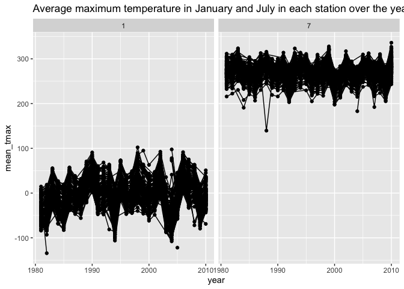
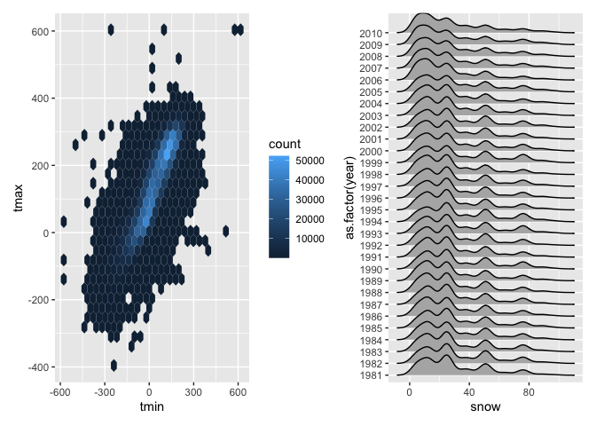

p8105_hw3_dcm2192
================
Dylan Morgan
2024-10-14

``` r
library(tidyverse)
library(tidyr)
library(ggridges)
library(patchwork)
library(p8105.datasets)
```

This code contains my answers to P8105 HW 3.

## Problem 1

Load NY NOAA dataset.

``` r
data("ny_noaa")
```

The `ny_noaa` dataset is comprised of 2595176 observations of 7
variables. Its variables include `id`, which is the weather station ID;
`date`, which is the date of observation; `prcp`, the amount of
precipitation measured in mm; `snow`, the amount of snowfall measured in
mm; `snwd`, the snow depth measured in mm; `tmax` and `tmin`, the
maximum and minimum temperatures in degrees Celsius. A significant
portion of the `ny_noaa` dataset contains missing data (values of 0 or
`NA`) for its measurements of precipitation, snowfall and depth, and
temperature.

Clean NY NOAA dataset.

Create separate columns for year, month, day. Adjust variables to
appropriate data types.

``` r
ny_noaa <- 
  ny_noaa |>  
  separate(date, into = c("year", "month", "day"), convert = TRUE) |> 
  mutate(
    tmax = as.numeric(tmax),
    tmin = as.numeric(tmin))
```

Find most commmon values for snowfall.

``` r
ny_noaa |> 
  count(snow) |> 
  arrange(desc(n))
```

    ## # A tibble: 282 × 2
    ##     snow       n
    ##    <int>   <int>
    ##  1     0 2008508
    ##  2    NA  381221
    ##  3    25   31022
    ##  4    13   23095
    ##  5    51   18274
    ##  6    76   10173
    ##  7     8    9962
    ##  8     5    9748
    ##  9    38    9197
    ## 10     3    8790
    ## # ℹ 272 more rows

The most commonly observed values for snowfall are 0, followed by `NA`.
This is because many of these observations are missing data for
snowfall, either because none was recorded on that day or because the
data was otherwise missing (possibly due to failure to take
measurements). Following these, the next most common values are 25mm,
13mm, and 51mm.

Two-panel plot of average max temp in January and July for all stations
and all years. Note observable structures and outliers.

``` r
ny_noaa |>  
  group_by(id, year, month) |>  
  filter(month %in% c(1, 7)) |>  
  summarize(mean_tmax = mean(tmax, na.rm = TRUE, color = id)) |>  
  ggplot(aes(x = year, y = mean_tmax, group = id)) + geom_point() + geom_path() +
  facet_grid(~month) +
  labs(title = "Average maximum temperature in January and July in each station over the years")
```

    ## `summarise()` has grouped output by 'id', 'year'. You can override using the
    ## `.groups` argument.

    ## Warning: Removed 5970 rows containing missing values or values outside the scale range
    ## (`geom_point()`).

    ## Warning: Removed 5931 rows containing missing values or values outside the scale range
    ## (`geom_path()`).

<!-- -->

The average maximum temperatures were consistently lower in January over
the years than in July. Each station appears to follow a consistent
pattern in maximum temperature recordings for a given month and year
such that they all generally matched one another in magnitude of
temperature. One outlier exists in July of approximately 1988 in which
the temperature recorded at one station was significantly lower than the
other stations at that time. In January of approximately 1983, there was
a notably lower temperature recording at one station compared to other
stations at that time.

1)  tmax vs. tmin for full dataset

``` r
temp_hex_plot <- ny_noaa |> 
  ggplot(aes(x = tmin, y = tmax)) + 
  geom_hex()
```

2)  plot showing distribution of snowfall values \>0 and \<100
    separately by year

``` r
snowfall_ridge_plot <- ny_noaa |>  
  filter(snow < 100, snow > 0) |> 
  ggplot(aes(x = snow, y = as.factor(year))) + 
  geom_density_ridges()
```

Create two panel plot with temp_hex_plot and snowfall_ridge_plot

``` r
temp_hex_plot + snowfall_ridge_plot
```

    ## Warning: Removed 1136276 rows containing non-finite outside the scale range
    ## (`stat_binhex()`).

    ## Picking joint bandwidth of 3.76

<!-- -->

## Problem 2

Load demographic and accelerometer data

``` r
covar <- read_csv("./data/nhanes_covar.csv")
```

    ## New names:
    ## Rows: 254 Columns: 5
    ## ── Column specification
    ## ──────────────────────────────────────────────────────── Delimiter: "," chr
    ## (5): ...1, 1 = male, ...3, ...4, 1 = Less than high school
    ## ℹ Use `spec()` to retrieve the full column specification for this data. ℹ
    ## Specify the column types or set `show_col_types = FALSE` to quiet this message.
    ## • `` -> `...1`
    ## • `` -> `...3`
    ## • `` -> `...4`

``` r
accel <- read_csv("./data/nhanes_accel.csv")
```

    ## Rows: 250 Columns: 1441
    ## ── Column specification ────────────────────────────────────────────────────────
    ## Delimiter: ","
    ## dbl (1441): SEQN, min1, min2, min3, min4, min5, min6, min7, min8, min9, min1...
    ## 
    ## ℹ Use `spec()` to retrieve the full column specification for this data.
    ## ℹ Specify the column types or set `show_col_types = FALSE` to quiet this message.

Load, tidy, merge, and otherwise organize the data sets. Your final
dataset should include all originally observed variables; exclude
participants less than 21 years of age, and those with missing
demographic data; and encode data with reasonable variable classes
(i.e. not numeric, and using factors with the ordering of tables and
plots in mind).

``` r
covar <- 
  covar |> 
  janitor::clean_names() |> 
  rename(
    SEQN = x1, 
    sex = x1_male, 
    age = x3, 
    BMI = x4, 
    education = x1_less_than_high_school
  )
```

``` r
covar <- 
  covar |> 
  filter(!is.na(SEQN), 
         !(SEQN == "SEQN")) |> 
  mutate(sex = recode(sex, `1` = "male", `2` = "female"),
         education = recode(education, 
                            `1` = "Less than high school", 
                            `2` = "High school equivalent", 
                            `3` = "More than high school"))
```
